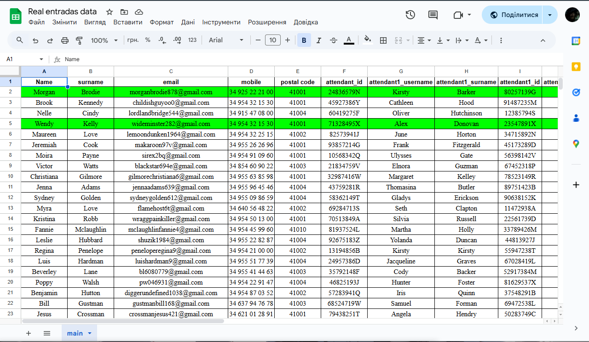
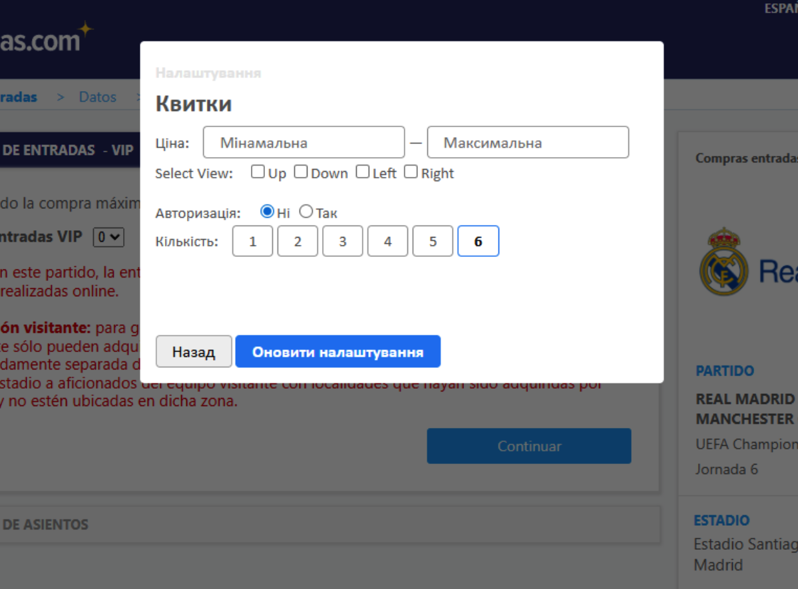
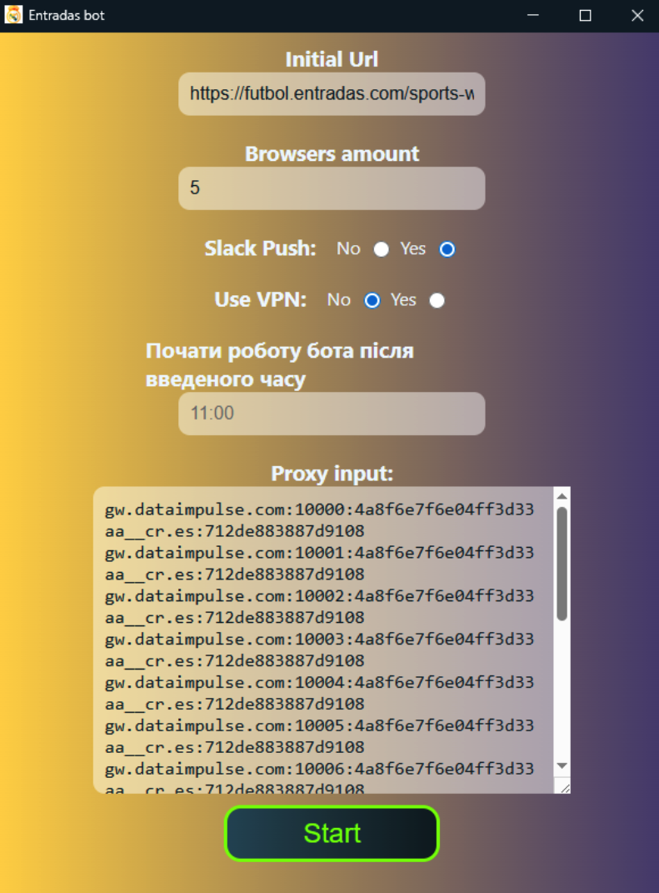

# Table of Contents

- [Overview](#overview)
- [How it works](#how-it-works)
- [Features](#features)
- [Requirements](#requirements)
- [Get Started](#get-started)
- [Spreadsheet Configuration Sample](#spreadsheet-configuration-sample)
- [Interface](#interface)
- [GUI](#gui)

# Overview

This project automates monitoring and reserving tickets on entradas.com for Real Madrid matches.
It launches multiple browser sessions, applies your settings, continuously checks availability, and assists in completing checkout forms using Google Sheets data.
The tool includes a GUI for easy setup, Slack notifications, sector caching with Redis, and a built-int browser extension for event-page configuration.

---

# How it works

The bot automatically launches multiple Chrome browser instances according ot the configuration you enter in the GUI.
Each browser can use its own proxy, user-agent, and independent settings. The bot continuously monitors ticket availability on Real Madrid event pages and applies your filters such as price, number of tickets madridista accounts etc.

A built-in browser extension is injected into each browser instance. It provides a simple interface inside the event page where you can adjust purchase-specific settings. These settings are stored locally using **IndexedDB/localstorage**, allowing each session to remember its configuration without any external storage.

The system integrates with:
- a local Flask server for communication between components
- Redis for **Sector Caching**, allowing the bot to temporarily ignore sectors it has already checked
- Slack for sending notifications about purchased tickets (if enabled)

The bot is designed to run multiple parallel instances for faster detection, automated retries, and improved resistance to access blocks.

---

# Features

- **Multi-browser parallel automation**
- **Proxy support and its rotation** (per-instance)
- **Automatic monitoring of entradas.com Real Madrid events**
- **Instant detection of new tickets**
- **Built-in browser extension** for event-page settings (IndexedDB-based)
- **Google Sheets autofill** for checkout forms
- **Sector Caching** with Redis (10-minute cooldown per sector)
- **Slack purchase notifications**
- **Automatic retries, error handling & anti-block logic**
- **Clean GUI for configuration**
- **Supports multi-instance runs on the same machine**

---

# Requirements

- Google Chrome
- Python 3.9+
- (Optional) Redis - for sector caching
- (Optional) Google Sheets - for autofill
- (Optional) Proxy services
- Optional but recommended: pre-created Slack app + token

---

# Get Started

1. Install requirements ```pip install -r requirements.txt``` or [install.bat](install.bat)
2. Setup you Google Sheets following the example in [Spreadsheet Configuration Sample](#spreadsheet-configuration-sample)
3. Run bot with ```python -m main.py``` [run.bat](run.bat)
4. Fill in GUI with necessary settings
5. Wait until bot configures at least one of browsers
6. Once bot enters an event page, use the **built-in browser extension** interface to configure event-specific purchase filters (see [Interface](#interface))

# Spreadsheet Configuration Sample

All configurations should be written on this table in sheet named "main":
https://docs.google.com/spreadsheets/d/1TniFrgJi9yJ2eUiCzCRistLUDCzn_v3udrZwhOzmaYI/edit?gid=0#gid=0

| Name                    | Description                                                     |
| ----------------------- | --------------------------------------------------------------- |
| **Name**                | Buyer’s first name used to autofill checkout forms.             |
| **surname**             | Buyer’s last name used to autofill checkout forms.              |
| **email**               | Buyer’s email used for contact and confirmation in checkout.    |
| **mobile**              | Buyer’s phone number used in checkout contact details.          |
| **postal code**         | Buyer’s postal or ZIP code for billing/shipping details.        |
| **attendant_id**        | ID or document number for the main buyer used in checkout.      |
| **attendant1_username** | First attendee’s first name used to fill attendee details.      |
| **attendant1_surname**  | First attendee’s last name used to fill attendee details.       |
| **attendant1_id**       | First attendee’s ID or document number.                         |
| **attendant2_username** | Second attendee’s first name used in attendee form.             |
| **attendant2_surname**  | Second attendee’s last name used in attendee form.              |
| **attendant2_id**       | Second attendee’s ID or document number.                        |
| **attendant3_username** | Third attendee’s first name used in attendee form.              |
| **attendant3_surname**  | Third attendee’s last name used in attendee form.               |
| **attendant3_id**       | Third attendee’s ID or document number.                         |
| **ADS**                 | Optional reference to adspower browser id which data is used for|

## Spreadsheet Configuration sample



# Interface

## Interface Sample

This part of interface is a brief description of script status. It contains:
- Resume/Stop buttons
- Fill Data that is used to fill in purchase form with pre-written google sheets information
- "Налаштування" leads to main pop-up with settings that bot should rely on when work


## Interface Settings Sample

In this part of interface you can pass to bot Settings information about what kind of tickets do you want to buy.
- Price range
- Sides of stadium
- Amount of tickets
- Categories
- Additional sectors
- Interval of page update

Settings are saved automatically to IndexedDB/localStorage.


# GUI

A standalone desktop window where you configure:
- Number of browser instances
- Proxies
- Slack settings
- Redis usage
- General bot parameters


